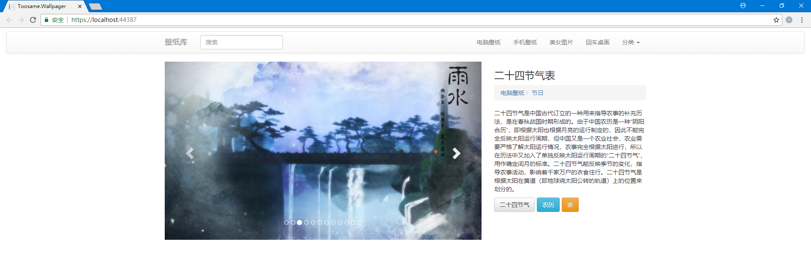

# Toosame Wallpager

使用React + ASP.NET Core的开源壁纸资源站点，包括168259条壁纸数据库备份文件



## 接口目录

+ [图片](#图片)

	+ [获取今日推荐壁纸](#获取今日推荐壁纸)

	+ [获取单张壁纸详情](#获取单张壁纸详情)

	+ [搜索壁纸](#搜索壁纸)

	+ [随机推荐壁纸](#随机推荐壁纸)

+ [频道](#频道)
	
	+ [获取所有频道](#获取所有频道)

	+ [根据频道获取壁纸列表](#根据频道获取壁纸列表)

+ [标签](#标签)

	+ [随机返回壁纸标签](#随机返回壁纸标签)

	+ [根据标签获取壁纸列表](#根据标签获取壁纸列表)

***

## 图片

### 获取今日推荐壁纸

每24小时更新一次

```HTTP
GET Http://<yourHost>/api/picture HTTP/1.1
```

### 获取单张壁纸详情

```HTTP
GET Http://<yourHost>/api/picture/<图片ID> HTTP/1.1
```

### 搜索壁纸

```HTTP
GET Http://<yourHost>/api/picture/search?keyword=<搜索关键词>&index=<页码>&size=<页大小> HTTP/1.1
```

### 随机推荐壁纸

```HTTP
GET Http://<yourHost>/api/picture/recommend?count=<随机推荐的数量> HTTP/1.1
```

## 频道

### 获取所有频道

```HTTP
GET Http://<yourHost>/api/channel/get HTTP/1.1
```

### 根据频道获取壁纸列表

```HTTP
GET Http://<yourHost>/api/channel/<频道ID>?index=<页码>&size=<页大小> HTTP/1.1
```

## 标签

### 随机返回壁纸标签

```HTTP
GET Http://<yourHost>/api/tag/get?count=<随机返回的标签数量> HTTP/1.1
```

### 根据标签获取壁纸列表

```HTTP
GET Http://<yourHost>/api/tag/<标签名或标签ID>?index=<页码>&size=<页大小> HTTP/1.1
```